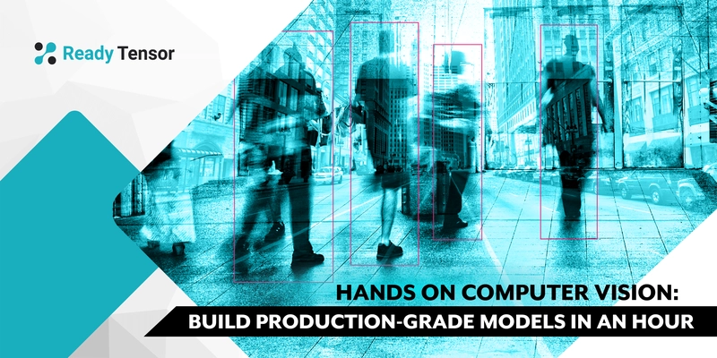

# Computer Vision Workshop with Deep Learning

Welcome to the **Computer Vision Workshop** repository! This repository contains hands-on tutorials, code, and examples for implementing key computer vision tasks using state-of-the-art deep learning models. This material was prepared as part of the **Ready Tensor Computer Vision Webinar Series**.

## Table of Contents
1. [Overview](#overview)
2. [Content Covered](#content-covered)
3. [Repository Structure](#repository-structure)
4. [Setup Instructions](#setup-instructions)
5. [Usage Guide](#usage-guide)
6. [License](#license)

---

## Overview
In this workshop, we explore practical implementations of core computer vision tasks using pre-trained models and custom training strategies. This hands-on guide is perfect for beginners and intermediate practitioners aiming to strengthen their understanding of deep learning for vision-based tasks.

---

## Content Covered
The workshop focuses on the following key areas:

1. **Image Classification**
   - Use of pre-trained models like ResNet and InceptionV3 for classifying images into categories.

2. **Object Detection**
   - Implementing object detection with YOLO (You Only Look Once) models.
   - Drawing bounding boxes and classifying objects within images.

3. **Semantic Segmentation**
   - Performing pixel-level classification to identify precise object boundaries in images.

Each section includes clear explanations, code implementations, and sample data to ensure an easy learning curve.

---

## Repository Structure
The repository is organized as follows:

```plaintext
├── notebooks/
│   ├── reference/
│   │   ├── 01_image_classification.ipynb   # Image Classification Tutorial
│   │   ├── 02_object_detection.ipynb       # Object Detection Tutorial
│   │   ├── 03_semantic_segmentation.ipynb  # Semantic Segmentation Tutorial
│   │   ├── 04_video_inference.ipynb        # Video Inference Tutorial
│   │   ├── 05_webcam_demo.ipynb            # Webcam Object Detection Demo
│   │   # Experiment with these 5 notebooks to explore and apply each of the 5 core computer vision applications.
│   │   
│   ├── webinar.ipynb # The main workshop notebook
│
├── data/
│   ├── models/                            # Directory containing the downloaded models   
│   ├── outputs/                           # Output results from models
│   │   ├── object_tracking/               # Object tracking results (notebook number 4 in references directory)
│   │   ├── .gitkeep
│   ├── visuals/                           # Input data (images and videos)
│   │   ├── image_classification/          # Visual inputs for image classification
│   │   ├── object_detection/              # Visual inputs for object detection
│   │   ├── object_tracking/               # Visual inputs for object tracking
│   │   ├── semantic_segmentation/         # Visual inputs for semantic segmentation
│
├── utils/
│   ├── helpers.py                          # Utility functions and helper code
│
├── requirements.txt                        # Python dependencies
├── hero.webp                               # Hero image for documentation
└── README.md                               # This README file
```

- **notebooks/reference/**: Contains Jupyter Notebooks for each core task (classification, detection, segmentation, video inference, webcam demo). Experiment with these 5 notebooks to explore and apply each of the 5 core computer vision applications.
- **data/models/**: Includes pre-trained models like YOLOv8 and YOLOv11 for quick inference.
- **data/outputs/**: Stores outputs generated by the models, such as object tracking results.
- **data/visuals/**: Organized folders for visual inputs for different tasks.
- **utils/**: Helper scripts to simplify repetitive tasks.

---

## Setup Instructions
Follow these steps to set up the environment and run the notebooks:

### 1. Clone the Repository
```bash
git clone https://github.com/readytensor/rt-cv-2024-webinar.git
cd rt-cv-2024-webinar
```

### 2. Create a Virtual Environment
```bash
# For Linux/Mac
a. python -m venv venv
b. source venv/bin/activate

# For Windows
venv\Scripts\activate
```

### 3. Install Dependencies
```bash
pip install -r requirements.txt
```

### 4. Register Environment with Jupyter
```bash
python -m ipykernel install --user --name=cv-webinar --display-name="Ready Tensor CV Webinar 2024"
```

### 5. Start Jupyter Notebook
```bash
jupyter notebook
```

In the Jupyter interface, select the kernel **"Ready Tensor CV Webinar 2024"** for running the notebooks.

---

## Usage Guide
1. Open the desired notebook from the **notebooks/reference/** folder.
2. Follow the step-by-step implementation provided in each section.
3. Replace sample images with your own datasets for experimentation.
4. Explore, experiment, and learn!

---

## License
This project is licensed under the [MIT License](LICENSE). You are free to use, modify, and distribute this code for educational and research purposes.

---

